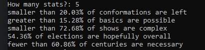

# Totally True Stats

This is a silly project of a browser-hosted machine learning model that generates random, technically true statistics. Uses TensorflowJS and Typescript in an Express/NodeJS server. You can clone the repo and run it yourself, or visit my site to view it.

This write-up runs through the entire process and thinking that I went through over the two weeks of developing Totally True Stats. While doing this I didn't find that many TensorflowJS projects that I could ~~steal code~~ take inspiration from, so I hope this can help someone.

The code for this project is available in three directories:
Word Collection
Model Testing
Site Deployment
All repositories are standalone programs (though not meant for any real use). The last repository is a working section of my personal website where the model was deployed. 

# The Idea

It started when I thought of a random stat, something like ‘98% of people exist’, and how ambiguous that could be. According to common thought processes, that statistic would imply that 2% of people don’t exist. But technically the other 2% of people could exist, as this statistic never says anything about the other 2%. Even if the stat said only 98% of people exist, not only is there ambiguity in what the word ‘exist’ means (does a dead person not exist? What about a fictional one?), but more importantly there is no knowledge of the sample size taken. This means that the statistic could be talking about any group of people, even a completely arbitrary group only made to prove the statistic as true. Those are some of the ways that statistics can be totally true, but through the use of ambiguous language can imply something totally wrong, and so can intentionally mislead people.

With that in mind I wanted to make something that generates one of these statistics that could technically be correct, just for the fun of it (and because language programming is interesting). My next attempt was to only randomly choose one part of the stat and to use machine learning to select the other part of the stat from a list, and the last approach which I settled on was to not confine the model to a list but randomly choose from its top answers when given an incomplete stat.

# 100% Random
My initial approach was to completely randomly generate a stat from a list of nouns and adjectives, in a format like “x% of {plural noun} are {adjective}”. So I looked around on sites like kaggle for lists of nouns and verbs, but couldn’t find any, so I then looked at different corpuses. 

The first one was the princeton database, however its tools haven’t been updated since 2006, and there isn’t a tool version for their 3.0 database on windows. Thankfully I came across a similar project called The Great Noun List, that had an amazing detailed walkthrough on the process of curating this list. Even though the guide was in R, I was able to implement a similar method using C#, which you can find in this repo. To summarise, it reads data from the MASC corpus, using a regex expression to find words annotated with different parts of speech. It then sorts the words by popularity and only selects those above a certain % usage, and writes those to a text file.

Initially I thought that this would be enough, and I implemented a simple random word selector to generate stats. Unfortunately, I found that the sentences sometimes didn’t make grammatical sense, and almost never made any actual sense at all.

# Machine Learning
So what did I do when I saw that the program I had made didn’t make much sense? Incorporate machine learning, of course. I had the format, “x% of {plural noun} are {adjective}”, I had a list of nouns, and a list of adjectives, so all I needed was to choose the right word for each situation. 

In my research, I figured out one solution would be what’s called “masked language learning”, where a sentence has a word removed, or masked, and a machine learning model must choose the most appropriate word to fit that mask. I looked around at different models, and I found a variation on the BERT model, called FITBERT. It seemed to make sense, because it could fill the blanks from a pre-selected list of options.

Implementing this, I soon found that the code that made FITBERT from the base BERT model was actually simpler than I expected, so I decided to take the opportunity to rewrite it and understand how it worked.

## Tokenising:
Tokenising sounds like a complex thing, but it’s essentially taking what is a normal sentence, and breaking it into pieces that the model can understand, and can be used as input for it to process. For example, the sentence `this is a ***mask***.` will be tokenised into a list like so:

"[CLS]", "this","is", "a", "[MASK]", ".", "[SEP]"

Each token is a word (or in some cases a sub-word). The stream starts with "[CLS]" which indicates this is a task for sentence classification, and ends with "[SEP]" which is used to separate streams. We also have a "[MASK]" token which is the word that we'd like the model to replace. Sometimes included in this step is converting the tokens to numerical values, or token ids, which is often done using a dictionary of tokens that map to their corresponding integer id. This is because the model can't actually process characters, and instead operates on these numerical ids.

## Prediction and Processing
This is where the magic happens. We input a stream of these token ids, and then the model will output an array of tensors for each token of the inputted sentence. Each array is the length of how many tokens the model knows, something like 32 000, with the index of each element corresponding to the token id, and the value at the index being the ranking of how correct that token is. Here's an example table, where each column is an input token, and each row is the rating (or tensor) of a replacement token:

And so on for 10s of thousands of rows.

For my purpose, the only array I'm interested in is that corresponding to the “[MASK]” token. A function called `softmax` is applied to the tensors to get the probabilities of each token, and the array is sorted in order of probability to find the most likely tokens to fill in that mask. My first approach only chose the tokens that were in a predefined list, however I soon discovered that not restricting the tokens to choose actually led to more fitting predictions (who could’ve known).

## The method

Now the lists of nouns and adjectives are still helpful, because those can be used to randomly generate an incomplete probability, which the model can then predict the missing part. For example the template will look like

`50% of {noun} are {adjective}`

The list can be used to randomly choose a noun, leading to

`50% of people are {adjective}`

and then the model can complete the sentence, by putting a `[MASK]` token where the adjective should be, resulting in

`50% of people are interesting`

# Implementation 
Up to this point I’d only experimented with models in python on my local machine, however my goal was to have this generator on my site.

At first I tried running the model on the web server itself, however memory constraints on the hosting services that were available to me meant this wasn’t going to work. It took me longer than it should for me to realise this, and I partially blame this on the hosting services that gave very unhelpful error messages when it came to the server not having enough RAM (cough heroku cough azure cough), usually during the build process. 

With hosting it on the server out of the question, I decided to try hosting it in the browser. There were a few ways to do this. I tried ONNX, however I couldn’t get the model’s size reduced enough for it to run in browsers without very long load times. I then tried TensorflowJS, and had more success with reducing the model’s size, with about 100MB for BERT medium and 25MB for BERT mobile. The API for tensorflow was also better documented than for ONNX.

With the API decided, all that was left was to actually code it. About a week later of struggling with javascript browser imports, switching from dot net to nodejs, and annoying memory leaks, I finally had a working version:

## Web Workers
This worked alright, but there was an issue with loading, and generating, and that was whenever the model was running the UI would completely freeze. To attempt to solve this issue, I tried to use Web Workers, which is where javascript can run in the background. I could use a web worker to load the model and generate the stats, and that would free the UI scripts to continue normally. In retrospect though, this wasn't worth the effort.

Web workers isn't supported on mobile, the main platform where performance matters, and I also found that it didn't work on non-chrome browsers (it might work but from my testing on Firefox and Safari I couldn't get it to). It also added a lot more complexity to what should have been a simple project, because I had to load separate scripts for each platform, as well as loading the web worker script, and that required a module loader. Organising and structuring this javascript was a little difficult to say the least. In the end, it didn't even load or respond that much faster than the original.

## Sharing
Once I had a working version, I started sharing this with my friends to test, and I realised that it was a little inconvenient to have to send screenshots of the generated stats every time you wanted to share something. So, I thought of a way of encoding the generated stat into a url, and have the server respond to any GET requests by displaying the encoded stat. The reason the stat was encoded was because seeing the actual words in the link made loading the page less of a surprise. The encoding was simple, all I did was replace whitespaces with a hyphen, and shift the characters by a certain amount. It's not meant to be secure, just unrecognizable for whoever was going to click on the link.

With those and some other minor changes such as adding a help menu and allowing stats for custom nouns, I was done with Totally True Stats. Overall it was an interesting learning experience, and it definitely made me more aware of js/ts's challenges and weird quirks.

# Contributing
This is a solo project and I won't be actively working on it, however if you have any suggestions or things that I could do better then feel free to open an issue or pull request.

# License

MIT, do what you'd like